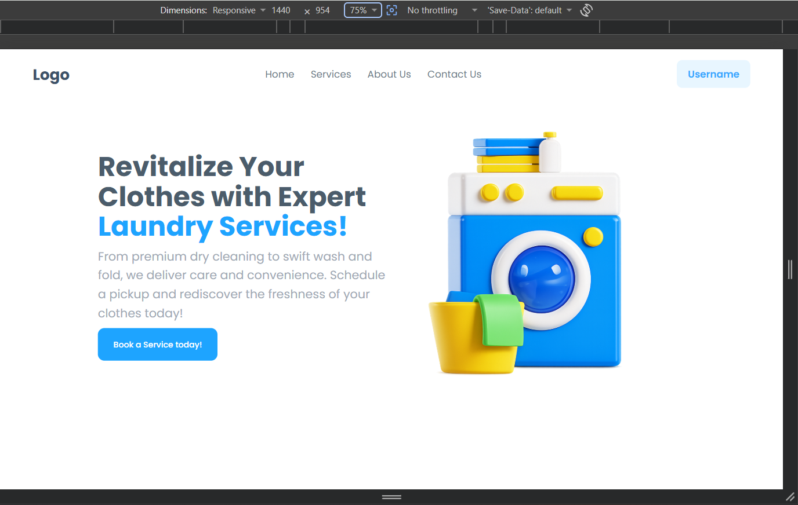
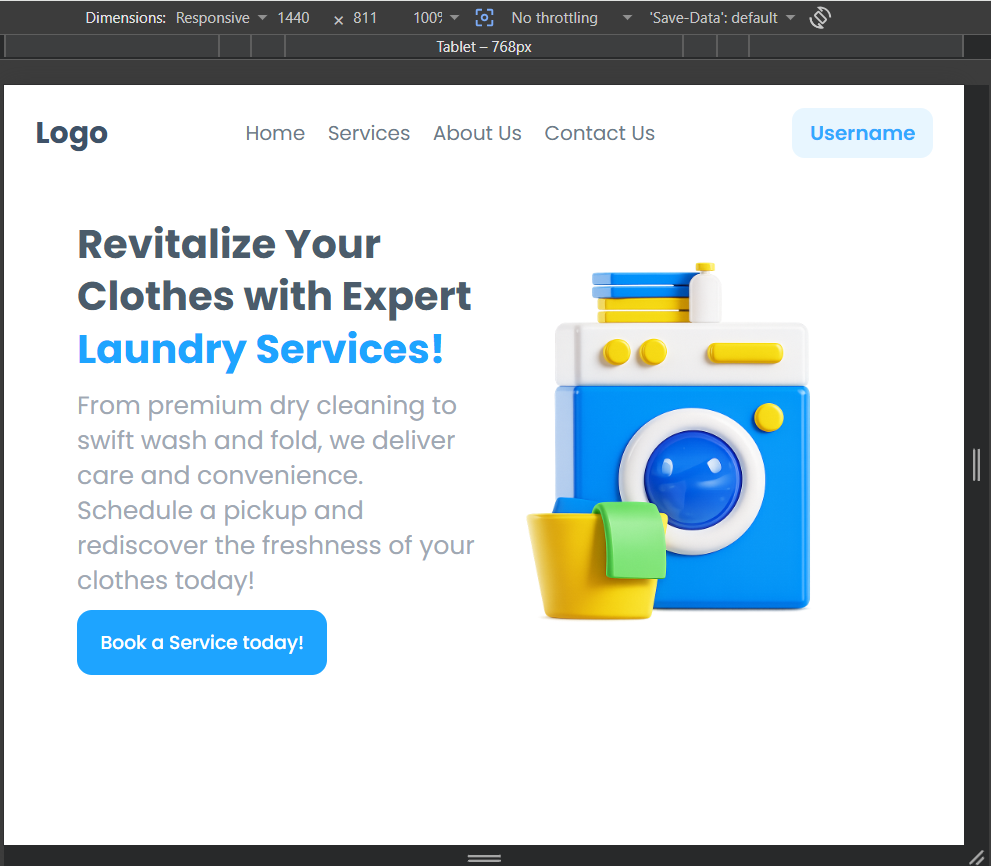
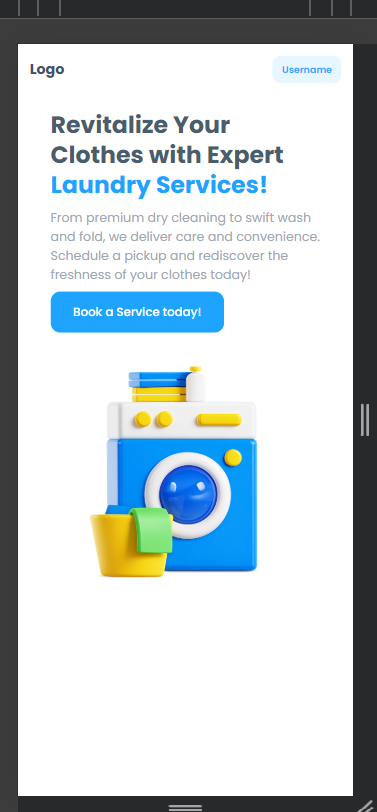

# Laundry Service Responsive Landing Page

## Features
- Responsive Navigation Bar
- Responsive Hero Section
- Built using CSS Flexbox
- Tablet and Mobile Media Queries

## Technologies Used
- HTML
- CSS

## Responsive Design
### Desktop View
- Navigation Links displayed horizontally.
- Hero section displayed in two columns.
- Large heading and image.
#### Screenshot-Desktop View

### Tablet View (<=768px)
- Reduced Font sizes.
- Smaller image.
- Adjust spacing and padding.
- Navigation remains Visible.
#### Screenshot-Tablet View

### Mobile View(<=480px>)
- Navigation menu links are hidden.
- Only logo and username remain visible.
- Hero section Changes to a single-column layout.
#### Screenshot-Mobile View

## How to Run

- Download the ADITYA_TASK7.zip file.
- Open index.html in your web browser.
 
## Author
Aditya Suryawanshi